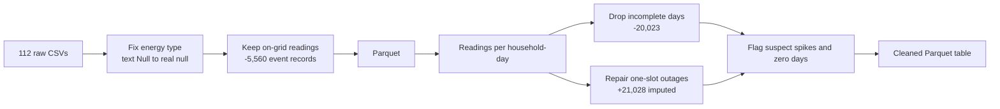

# London smart meter analysis (PySpark)

167.8 million half-hourly electricity readings from London households in UK Power Networks' Low Carbon London trial, November 2011 to February 2014. In 2013 about a thousand of these households were moved onto a dynamic time-of-use tariff, with prices that changed by time of day, while the rest stayed on a standard tariff. The end goal of this project is to ask whether those price signals actually changed when people used electricity.

Getting there starts with cleaning data at a size where pandas stops being an option. That stage is finished: [`notebooks/01_ingestion_and_cleaning.ipynb`](notebooks/01_ingestion_and_cleaning.ipynb).

## What the raw data was hiding

**The missing values were invisible at first.** Missing readings are stored as the text `Null`, so Spark's schema inference reads the whole energy column as a string, and a standard null check reports zero missing values. Casting with `try_cast` turned them into 5,560 real nulls.

**None of those nulls were missing readings.** 5,521 of them were logged on one afternoon, 18 December 2012 between 15:13 and 15:17, one per household across almost the entire meter fleet. Every one of the 5,560 has a seconds-precise timestamp off the half-hour grid (15:13:44, 15:17:02, …), and the households' normal 15:00 and 15:30 readings are all present. They're event records from some fleet-wide system event, not gaps, so one rule removes them with no data lost: keep only readings on :00 and :30.

**The real gaps were rows that didn't exist.** Counting readings per household per day against the expected 48 showed three separate patterns rather than random loss:

- Each household's first and last day is partial. The meter joined the trial partway through a day, and after the last full day there's a single stray reading at 00:00.
- 21,028 days are missing exactly one reading, clustered on specific dates: 826 households lost the same slot on 17 June 2012, 600 on 14 June 2012, 569 on 20 January 2014. These are fleet-wide outages, so dropping those days would remove large parts of the sample from particular dates. I repaired the one missing slot from its neighbours instead, and flagged it.
- About 3,000 days have scattered genuine gaps. Those days are dropped, because summing an incomplete day quietly understates it.


**The extreme values are mostly real.** The highest reading is 10.76 kWh in half an hour, about 21.5 kW, near the limit of a domestic supply. It's sustained across consecutive half-hours on several winter evenings, which is what genuine heavy load looks like. Of 2,330 isolated readings above 3 kWh, nearly all fit a short burst from a high-power appliance such as an electric shower. Nine don't: eight come from one household at a near-constant 8.3–8.6 kWh between near-zero readings, often in the early hours. They're flagged as suspected meter artefacts and kept. Nothing was capped.

**Some meters stopped measuring.** 14,954 household-days total exactly zero. They're concentrated: ten households account for 37% of them, and one has 783 zero days. They're flagged, so later analyses can decide whether to exclude them.

## Cleaning in numbers

| Stage | Rows | Household-days |
|---|---:|---:|
| Raw half-hourly files (112 CSVs) | 167,817,021 | |
| Off-grid event records removed | −5,560 | |
| On the half-hour grid | 167,811,461 | 3,510,403 |
| Incomplete days dropped | −294,249 | −20,023 |
| One-slot outages repaired | +21,028 | |
| **Cleaned table** | **167,538,240** | **3,490,380** |

Every household-day in the cleaned table has exactly 48 readings, and 3,490,380 × 48 = 167,538,240 confirms it. 99.4% of household-days on the grid survived cleaning.



## The cleaned table

| Column | Type | Meaning |
|---|---|---|
| `household_id` | string | Household identifier (`MAC000001`, …) |
| `timestamp` | timestamp | Half-hour slot, UTC |
| `energy_kwh` | double | Consumption in that half-hour |
| `imputed` | boolean | Reading interpolated during the one-slot outage repair |
| `suspect_spike` | boolean | Isolated reading above 6 kWh between low neighbours |
| `zero_day` | boolean | Reading belongs to a day whose total is zero |

## Running it

The notebook runs in Google Colab. You'll need a Kaggle API token: on Kaggle, go to Settings → API → Create New Token, then add the username and key to Colab Secrets as `KAGGLE_USER` and `KAGGLE_API_TOKEN` with notebook access switched on. The notebook downloads the data itself. The full run takes a while because the first steps read all 112 CSVs; everything after the Parquet conversion is much faster.

Data files are not stored in this repository.

```
london-smart-meter-analysis/
├── notebooks/
│   └── 01_ingestion_and_cleaning.ipynb
├── figures/
│   └── readings_per_household_day.png
├── requirements.txt
└── README.md
```

## Roadmap

- [x] 01 · Ingestion and cleaning
- [ ] 02 · Preparation: household tariff group and ACORN socio-economic group, hourly weather, bank holidays, household coverage threshold
- [ ] 03 · Exploration: daily and seasonal load profiles, weekday against weekend, temperature effects
- [ ] 04 · Did time-of-use pricing change behaviour? Tariff and standard groups before and during 2013
- [ ] 05 · Household segmentation by daily load shape, and day-ahead demand forecasting

## Open questions

Every household's final reading falls at 00:00, which suggests the timestamps may mark the end of each half-hour rather than the start. That changes which day a midnight reading belongs to in daily totals, and I haven't yet found it stated in the trial documentation. If you know the Low Carbon London convention, please open an issue.

The cause of the fleet-wide event on 18 December 2012 is also undocumented as far as I can tell.

## Data

UK Power Networks, *SmartMeter Energy Consumption Data in London Households*, Low Carbon London project, published on the [London Datastore](https://data.london.gov.uk/dataset/smartmeter-energy-use-data-in-london-households). This project uses the version on Kaggle, [Smart meters in London](https://www.kaggle.com/datasets/jeanmidev/smart-meters-in-london) (jeanmidev), which adds London weather and UK bank holidays. See the London Datastore page for licence terms.

---

Thashmika Bandara · PhD candidate, Electrical Engineering, City St George's, University of London
