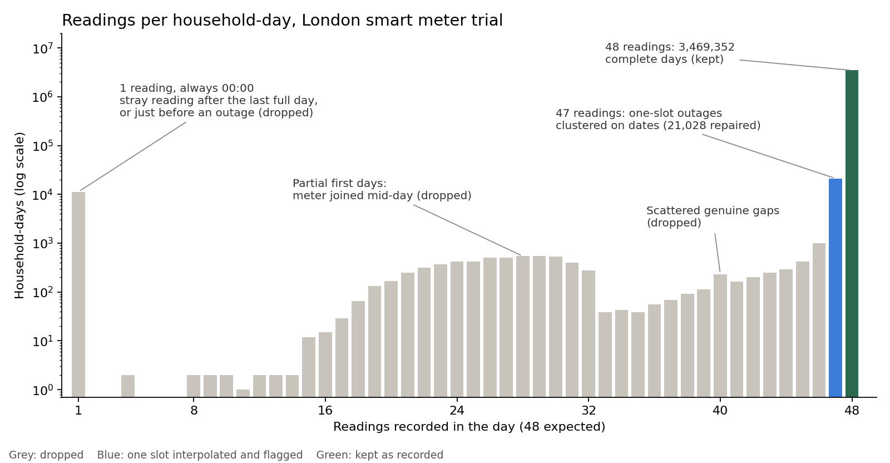
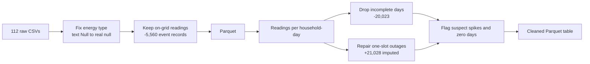

# London smart meter analysis (PySpark)

167.8 million half-hourly electricity readings from London households in UK Power Networks' Low Carbon London trial, November 2011 to February 2014. In 2013 about a thousand of these households were moved onto a dynamic time-of-use tariff, with prices that changed by time of day, while the rest stayed on a standard tariff. The project asks four questions in turn: did those price signals change when people used electricity, did the households save money, did they save carbon, and which kinds of household are able to shift their demand at all?

Getting there starts with cleaning data at a size where pandas stops being an option, then bringing in prices, grid carbon intensity and weather. Both stages are finished:

- [`notebooks/01_ingestion_and_cleaning.ipynb`](notebooks/01_ingestion_and_cleaning.ipynb) cleans the 167.8 million meter readings.
- [`notebooks/02_preparing_for_analysis.ipynb`](notebooks/02_preparing_for_analysis.ipynb) checks and joins the other sources and builds the daily analysis table.

The analysis so far: behaviour and bills in [`notebooks/03_did_tou_change_behaviour.ipynb`](notebooks/03_did_tou_change_behaviour.ipynb), and carbon in [`notebooks/04_did_tou_cut_carbon.ipynb`](notebooks/04_did_tou_cut_carbon.ipynb).

## Did dynamic pricing change behaviour, and did it save money?


**Households responded, a little.** Everyone used about 6% less in the second half of 2013 than a year earlier, largely because it was milder (16% fewer heating degree days). Time-of-use households cut a further **1.8%** on top of that, about **65 kWh a year** each, and **2.6%** of their evening-peak use (16:00–19:00).

**Across many homes, that adds up.** For every 1,000 homes on the tariff, the evening peak was about **16 kW lower**: roughly five kettles switched off for the whole evening, every evening.

**They used less in the evening, but didn't move their evening use elsewhere.** The evening peak fell in step with the rest of the day. The trial's price events moved from day to day, so households were reacting to specific announced events rather than avoiding a fixed evening window.

**The money was modest.** The average time-of-use household saved about **£14 a year** against the flat rate (median £10), roughly **3% of a £470 annual bill**. **87%** came out ahead, while about 1 in 7 paid more.

**Half of that came from responding.** A household that ignored the prices would have paid only about 1.5% less per kWh, because the cheap Normal rate is largely cancelled out by the expensive High-price events. Responding cut a further **0.22p per kWh** (95% CI 0.19–0.25p), doubling the saving.

**What it means:** price signals do change behaviour, measurably, but gently, and the reward for responding was small. Bigger shifts would likely need larger price differences or automation that responds on the household's behalf.

*How it was measured:* the comparison follows 1,062 time-of-use and 4,146 standard households from July–December 2012 (before) to July–December 2013 (prices in effect). The effect is how much more the time-of-use group changed than the standard group, so anything that affected everyone, like the weather, cancels out. Savings price each household's actual 2013 use on both tariffs. Time-of-use households were volunteers, so the comparison is between volunteers and a control group.

## Did it cut carbon, and would shifting evening demand have helped?


**The tariff didn't measurably cut carbon.** Time-of-use households' emissions fell about 1.1% more than standard households', which is within noise, and their electricity was no cleaner per kWh than anyone else's.

**The prices were never pointed at carbon.** High-price half-hours were no dirtier than normal ones (474.6 against 474.5 g CO₂/kWh), and low-price half-hours, when households were nudged to use more, were slightly dirtier (479.2). The events were designed for network and supply-balancing needs, so even a perfect response couldn't have cut carbon through timing.

**Moving evening demand overnight wouldn't have helped either.** If every London home had moved 10% of its 16:00–19:00 use to 00:00–06:00, about 211 GWh a year would have changed time:

- By the **average grid mix**, which barely changed through the day in 2013 (474 g/kWh in the evening, 471 overnight), London would have saved about **110 tonnes of CO₂ a year**: effectively nothing.
- By the plants that **actually change output when demand moves**, it would have **added roughly 60,000–74,000 tonnes a year**, about 18–23 kg for every household. Overnight swings in demand were met by plants emitting around 600 g/kWh, consistent with coal at the margin; evening swings by plants at around 320 g/kWh. The 95% confidence intervals for the two windows are far apart.

**What it means:** off-peak is not the same as low-carbon. On the 2013 grid, easing the evening peak, which helps local networks, would have worked against the climate. A tariff that is meant to cut carbon has to target the hours that are genuinely clean. Britain's last coal plant closed in 2024, so today's grid behaves differently, but the principle holds.

*How it was measured:* carbon per household uses each half-hour's grid intensity from NESO. Marginal intensity is estimated from how total grid emissions change when total generation changes between consecutive half-hours, hour by hour (the approach of Hawkes, 2010). London totals scale 4,230 standard-tariff households to 3.27 million London homes (2011 Census).

## What the raw data was hiding

**The missing values were invisible at first.** Missing readings are stored as the text `Null`, so Spark's schema inference reads the whole energy column as a string, and a standard null check reports zero missing values. Casting with `try_cast` turned them into 5,560 real nulls.

**None of those nulls were missing readings.** 5,521 of them were logged on one afternoon, 18 December 2012 between 15:13 and 15:17, one per household across almost the entire meter fleet. Every one of the 5,560 has a seconds-precise timestamp off the half-hour grid (15:13:44, 15:17:02, …), and the households' normal 15:00 and 15:30 readings are all present. They're event records from some fleet-wide system event, not gaps, so one rule removes them with no data lost: keep only readings on :00 and :30.

**The real gaps were rows that didn't exist.** Counting readings per household per day against the expected 48 showed three separate patterns rather than random loss:

- Each household's first and last day is partial. The meter joined the trial partway through a day, and after the last full day there's a single stray reading at 00:00.
- 21,028 days are missing exactly one reading, clustered on specific dates: 826 households lost the same slot on 17 June 2012, 600 on 14 June 2012, 569 on 20 January 2014. These are fleet-wide outages, so dropping those days would remove large parts of the sample from particular dates. I repaired the one missing slot from its neighbours instead, and flagged it.
- About 3,000 days have scattered genuine gaps. Those days are dropped, because summing an incomplete day quietly understates it.



**The extreme values are mostly real.** The highest reading is 10.76 kWh in half an hour, about 21.5 kW, near the limit of a domestic supply. It's sustained across consecutive half-hours on several winter evenings, which is what genuine heavy load looks like. Of 2,330 isolated readings above 3 kWh, nearly all fit a short burst from a high-power appliance such as an electric shower. Nine don't: eight come from one household at a near-constant 8.3–8.6 kWh between near-zero readings, often in the early hours. They're flagged as suspected meter artefacts and kept. Nothing was capped.

**Some meters stopped measuring.** 14,954 household-days total exactly zero. They're concentrated: ten households account for 37% of them, and one has 783 zero days. They're flagged, so later analyses can decide whether to exclude them.

## Cleaning in numbers

| Stage | Rows | Household-days |
|---|---:|---:|
| Raw half-hourly files (112 CSVs) | 167,817,021 | |
| Off-grid event records removed | −5,560 | |
| On the half-hour grid | 167,811,461 | 3,510,403 |
| Incomplete days dropped | −294,249 | −20,023 |
| One-slot outages repaired | +21,028 | |
| **Cleaned table** | **167,538,240** | **3,490,380** |

Every household-day in the cleaned table has exactly 48 readings, and 3,490,380 × 48 = 167,538,240 confirms it. 99.4% of household-days on the grid survived cleaning.



## The cleaned table

| Column | Type | Meaning |
|---|---|---|
| `household_id` | string | Household identifier (`MAC000001`, …) |
| `timestamp` | timestamp | End of the half-hour the reading covers, GMT |
| `energy_kwh` | double | Consumption in that half-hour |
| `imputed` | boolean | Reading interpolated during the one-slot outage repair |
| `suspect_spike` | boolean | Isolated reading above 6 kWh between low neighbours |
| `zero_day` | boolean | Reading belongs to a day whose total is zero |

## Preparing the other data

Four more sources join the meter readings: each household's tariff group and ACORN socio-economic group, hourly London weather, the 2013 half-hourly price schedule from the London Datastore, and the half-hourly GB generation mix with grid carbon intensity from NESO.

**A file that parsed cleanly and was still wrong.** The bank holiday file loaded with a proper date type, but every date whose day and month were both 12 or less had them swapped: Good Friday 2012 sat on 4 June and Easter Monday on 4 September. It also had no 2011 holidays, although the meter data starts in November 2011. I replaced it with the official England list and used a day–month swap rule to repair the original as a cross-check; every repaired date matched.

**The weather lines up with the meters.** Two hours were missing (9–10 September 2013), but none of the clock-change hours were, and there were no duplicates, so the weather is in UTC/GMT like the meter data. Because the gaps were missing rows rather than nulls, the weather was put on a full hourly grid before filling them. Columns no analysis uses, pressure among them, were dropped rather than repaired.

**The grid was coal-heavy, and its carbon intensity swung widely.** Over the trial, intensity ranged from 259 to 644 gCO₂/kWh (median 493), and coal's median output was well above gas. Timing therefore matters: the dirtiest half-hours emitted about two and a half times as much per kWh as the cleanest.

**Households joined in two waves, which shaped the design.** Most meters were installed between April and July 2012, with a second wave in September and October, in the same proportions for both tariff groups. The tariff comparison therefore uses July–December 2012 as the baseline against July–December 2013. Households are flagged for each analysis rather than deleted: 1,062 time-of-use and 4,146 standard households have at least 60 usable days in both periods.

**The data settled which half-hour each reading covers.** Matching readings to the price schedule both ways, the alignment where a timestamp marks the *end* of its half-hour showed the sharper response to prices. It's consistent with every household's last reading falling at 00:00, though the two alignments differ by only about 0.2%.

**A first sign of a response.** Relative to their usage at Normal prices, time-of-use households used about 5% less in High-price half-hours and about 5% more in Low-price ones, compared with standard households. They also used about 9% less even at Normal prices, which looks like a difference between volunteers and the rest rather than a tariff effect. That's why the analysis compares change from the 2012 baseline.

## The analysis tables

| Table | One row per | Main contents |
|---|---|---|
| `halfhourly_cleaned` | household × half-hour | 167,538,240 readings with quality flags |
| `households` | household | tariff group, ACORN group, coverage, `in_tariff_comparison`, `in_2013_analysis` |
| `household_day` | household × day | 3,490,380 rows: kWh, 16:00–19:00 peak kWh, kg CO₂, time-of-use and flat-rate cost, calendar, temperature, flags |
| `weather_hourly` | hour | temperature, humidity, wind speed |
| `tariffs_2013` | half-hour of 2013 | price band and £/kWh |
| `generation_mix` | half-hour | carbon intensity and output by fuel |

## Running it

The notebooks run in Google Colab. You'll need a Kaggle API token: on Kaggle, go to Settings → API → Create New Token, then add the username and key to Colab Secrets as `KAGGLE_USER` and `KAGGLE_API_TOKEN` with notebook access switched on. Notebook 01 downloads the data itself; its full run takes a while because the first steps read all 112 CSVs.

Each notebook saves its outputs to `MyDrive/london-smart-meters/` in Google Drive, and the next one starts from there, so no notebook has to rerun an earlier one. Notebook 02 also needs `Tariffs.xlsx` from the London Datastore in `MyDrive/`; it fetches the NESO generation mix from the open API itself.

Data files are not stored in this repository.

```
london-smart-meter-analysis/
├── notebooks/
│   ├── 01_ingestion_and_cleaning.ipynb
│   ├── 02_preparing_for_analysis.ipynb
│   ├── 03_did_tou_change_behaviour.ipynb
│   └── 04_did_tou_cut_carbon.ipynb
├── figures/
│   ├── readings_per_household_day.png
│   ├── tou_effect_and_savings.png
│   └── carbon_off_peak_2013.png
├── requirements.txt
└── README.md
```

## Roadmap

- [x] 01 · Ingestion and cleaning
- [x] 02 · Preparation: households and coverage, weather, bank holidays, 2013 prices, grid carbon intensity, daily analysis table
- [x] 03 · Did time-of-use change behaviour, and did it save money? Change from the 2012 baseline, and bills split into what the price structure saved and what changed behaviour saved
- [x] 04 · Did it save carbon? The trial's actual effect, whether the prices were aligned with grid carbon, and a scenario: moving 10% of London's evening-peak use overnight, judged by average and marginal emissions
- [ ] 05 · A carbon-aligned tariff: re-time the price events by grid carbon, first with perfect knowledge of 2013, then using a day-ahead forecast model
- [ ] 06 · Household load profiles: clustering daily load shapes from 2012, then asking which profiles responded to prices

## Open questions

The cause of the fleet-wide event on 18 December 2012 is undocumented as far as I can tell.

The timestamp convention (a reading marks the end of its half-hour) was inferred from the data, since the trial documentation states the time zone (GMT) but not the convention. If you know it, please open an issue.

## Data

UK Power Networks, *SmartMeter Energy Consumption Data in London Households*, Low Carbon London project, published on the [London Datastore](https://data.london.gov.uk/dataset/smartmeter-energy-use-data-in-london-households). This project uses the version on Kaggle, [Smart meters in London](https://www.kaggle.com/datasets/jeanmidev/smart-meters-in-london) (jeanmidev), which adds London weather and UK bank holidays. See the London Datastore page for licence terms.

The 2013 time-of-use price schedule (`Tariffs.xlsx`) is from the same [London Datastore page](https://data.london.gov.uk/dataset/smartmeter-energy-consumption-data-in-london-households-vqm0d). Grid carbon intensity and generation by fuel are from NESO's [Historic GB Generation Mix](https://www.neso.energy/data-portal/historic-generation-mix/historic_gb_generation_mix). Bank holidays are the official England list from the [`holidays`](https://pypi.org/project/holidays/) Python package.

---

Thashmika Bandara · PhD candidate, Electrical Engineering, City St George's, University of London
